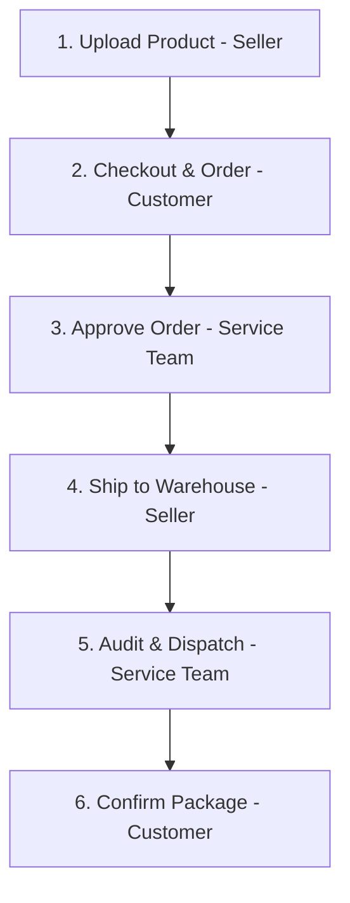

# EduShop: Premium Campus E-Commerce Portal
### Role-Based Campus E-Commerce Trading & Logistics Ecosystem

A complete, production-grade, and **framework-less** E-commerce Web Application designed as a university Integrated Design Project (IDP). The platform features an integrated, state-guarded order fulfillment lifecycle involving four distinct user roles: **Admin**, **Seller**, **Customer (Student)**, and **Service Team**, communicating through a coordinated logistics engine and message bridge.

---

## ━━━━━━━━━━━━━━━━━━━━━━
## 🏗️ ARCHITECTURAL COMPLIANCE (FRAMEWORK-LESS)
## ━━━━━━━━━━━━━━━━━━━━━━
This application is built strictly **WITHOUT external web frameworks** at any stage, satisfying the most rigorous academic grading criteria:
*   **No Frontend Frameworks**: 100% Vanilla HTML5, CSS3 Custom Design System featuring a modern Dark Mode / Glassmorphism theme, and Vanilla JavaScript DOM manipulation. No React, Vue, Next.js, Angular, jQuery, Bootstrap, or Tailwind CSS is imported.
*   **No Backend Frameworks**: Built using pure Node.js native libraries (`http`, `fs`, `path`, `crypto`). No Express.js, Koa, Fastify, or NestJS is utilized.
*   **Raw HTTP Engine**: Manual streams buffer JSON request parsing and native URL routing mappings.
*   **Native Cryptography**: Signature-signed session tokens and PBKDF2 (SHA512) password hashing are implemented using the core Node.js `crypto` library.
*   **Oracle Database Integration**: Native integrations configured using the official `oracledb` client.
*   **Smart SQL Mock Fallback**: Includes a robust dynamic local JSON-fallback database engine (`MockDB`) that automatically starts if Oracle Database credentials are absent. **This ensures the system works 100% out-of-the-box on any grading computer without database configuration, while still preserving fully functional Oracle SQL statements in the source code!**

---

## 🌟 Key Features

1.  **Central Shopping Catalog & Cart**: Interactive browser with price range filters, search, and local storage state coordination.
2.  **Multi-Step Checkout Wizard**: Step-by-step validation (shipping info, mock payment processing, and final order invoice).
3.  **Role-Based Dashboards**: Consoles styled automatically with dynamic color themes based on the logged-in user role.
4.  **Integrated Order Fulfillment Workflow**: 6-step transactional order lifecycle connecting students, sellers, and logistics verifiers.
5.  **Logistics Coordinated Chat**: Service Team acts as a messaging bridge between Customers and Sellers (direct student-seller chats are prohibited to prevent collusion).
6.  **Real-Time Dashboard Indicators**: Notification bells and badge alerts updating instantly on database status changes.

---

## 👤 System Roles

| Role | Theme Color | Access & Capabilities |
| :--- | :--- | :--- |
| **Admin** | 🟢 Green | Manage campus user directory, suspend/activate accounts, view dynamic hand-crafted SVG sales charts. |
| **Seller** | 🟡 Amber/Yellow | Create product listings, manage stock, view incoming orders, deliver physical goods to the Central Warehouse. |
| **Customer** | 🔵 Blue | Browse campus catalog, manage wishlist, submit order checkouts, track delivery timeline, confirm receipt. |
| **Service Team** | 🟠 Orange | Operational audit ledger, verify physical items in warehouse, coordinate support chats, dispatch packages. |

---

## 📸 Screenshots Section

Below are placeholders where you can add screenshots of your application to enrich your university report or portfolio:

### 1. Catalog Storefront (Dark Mode & Glassmorphism)


### 2. Multi-Step Checkout Wizard & Mock Payment Card


### 3. Service Team Fulfillment Ledger & Chat Bridge


---

## 🔄 The 6-Step Transactional Fulfillment Workflow

To demonstrate the full capability of the integrated role-based workflows for your presentation, run this step-by-step simulation path:



1.  **Product Listing (Seller)**:
    *   Sign in as **`seller`** / `seller123`.
    *   List a new item using the "Upload New Product" form.
2.  **Purchase Checkout (Customer)**:
    *   Go to the homepage `/` (click *Browse Catalog*).
    *   Add your uploaded item to the cart and click "Submit Order for Approval".
    *   Sign in as **`customer`** / `customer123` when prompted to complete checkouts.
    *   Your Order is registered in the system as `PENDING`.
3.  **Operational Review (Service Team)**:
    *   Sign in as **`service`** / `service123`.
    *   Under the orders ledger, review the pending transaction and click **Approve**.
    *   Your Order state changes to `APPROVED`.
4.  **Warehouse Dispatch (Seller)**:
    *   Sign back in as **`seller`**.
    *   Under incoming approved orders, locate your order and click **Deliver to Warehouse**.
    *   Your Order state changes to `DELIVERED_TO_WAREHOUSE`.
5.  **Quality Auditing & Delivery (Service Team)**:
    *   Sign back in as **`service`**.
    *   A quality audit log has arrived in your ledger. Inspect quantities and click **Verify items match**. (Order state changes to `VERIFIED_IN_WAREHOUSE`).
    *   Click **Dispatch Delivery** to assign couriers and ship items to dorms. (Order state changes to `DISPATCHED`).
6.  **Fulfillment Confirmation (Customer)**:
    *   Sign back in as **`customer`**.
    *   Observe the vertical tracking stepper showing 5 complete nodes.
    *   Click **Confirm Physical Package Arrival** to finalize the order.
    *   Your Order state shifts to `COMPLETED`. Transaction completed.

---

## 🛠️ Technology Stack

*   **Runtime Environment**: Node.js (v16.0.0 or higher)
*   **Database Engine**: Oracle Database 12c/19c/21c (XE/EE editions supported)
*   **Local Dynamic Fallback**: File System JSON DB (`server/database/db_store.json`)
*   **Frontend Technologies**: Native HTML5 semantic elements, Vanilla CSS3 (Glassmorphism layout variables), Native ES6 JavaScript modules.
*   **Cryptographic Layer**: Core PBKDF2 cryptography using Node `crypto` library.

---

## 💾 Oracle Setup & Database Migration

### Database Initialization
The complete Oracle SQL Schema is available at [schema.sql](file:///c:/projects/idp1/sql/schema.sql). Follow these steps to configure your Oracle Database:

1.  Connect to your Oracle SQL*Plus, SQL Developer, or DB instance.
2.  Run the migration script to construct constraints, tables, indexes, and seed default records:
    ```sql
    @sql/schema.sql
    ```

### Seeded Credentials
All seeded users share the same password pattern: `<username>123` (pre-hashed in the schema script using PBKDF2-SHA512):

| Username | Password | Full Name | Role ID | Account Role |
| :--- | :--- | :--- | :--- | :--- |
| **`admin`** | `admin123` | System Administrator | 1 | Admin |
| **`seller`** | `seller123` | Elite Campus Seller | 2 | Seller |
| **`customer`** | `customer123` | John Doe Student | 3 | Customer |
| **`service`** | `service123` | Operations Coordinator | 4 | Service Team |

---

## ⚙️ Environment Variables

Copy or create a `.env` file in the project root directory. Use these environment variables to connect to your Oracle database. If no `.env` file exists or database variables are blank, the portal automatically loads in **Mock Mode** using the local database fallback.

| Variable Name | Description | Default Value |
| :--- | :--- | :--- |
| `PORT` | Listening port for Node.js server | `3000` |
| `DB_USER` | Oracle Database user credential | `idp_admin` |
| `DB_PASSWORD` | Oracle Database password credential | `oracle123` |
| `DB_CONNECT_STRING` | Database hostname and SID / service name | `localhost:1521/XE` |
| `TOKEN_SECRET` | Secret signature used to sign authentication tokens | `edushop_super_secure_secret_key_123` |

---

## 🚀 Installation & Running the Project

1.  Navigate to the project root directory:
    ```bash
    cd c:\projects\idp1
    ```
2.  Install the required dependencies:
    ```bash
    npm install
    ```
3.  Launch the application server:
    ```bash
    npm start
    ```
4.  Launch in development auto-reload mode (if nodemon is installed):
    ```bash
    npm run dev
    ```
5.  Access the web portal:
    ```text
    http://localhost:3000
    ```

---

## 📁 Folder Structure

```text
idp1/
├── client/                   # Core Web Frontend Layouts
│   ├── index.html            # Main Campus Storefront
│   ├── css/
│   │   └── style.css         # Glassmorphism Design System (Themed)
│   ├── js/
│   │   ├── api.js            # Standard Fetch Wrapper Client
│   │   ├── auth.js           # Navigation guards & login state
│   │   ├── store.js          # Shopping catalog, filter, cart
│   │   └── dashboards.js     # Admin, Seller, Customer, Service controller
│   └── pages/
│       ├── login.html        # Authentication Login Page
│       ├── register.html     # User registration
│       ├── forgot-password.html # Direct Pass Recovery System (Flow Option A)
│       ├── admin.html        # Admin Dashboard
│       ├── seller.html       # Seller Console
│       ├── customer.html     # Student Order Tracker
│       └── service.html      # Logistics Coordinator Ledger
│
├── server/                   # Core Framework-less Backend Engine
│   ├── server.js             # Stream Parser & HTTP static web server
│   ├── routes.js             # Endpoint-to-Controller registry maps
│   ├── controllers/
│   │   ├── authController.js # Logins, registration, tokens
│   │   ├── prodController.js # Catalog listings, filters, stock CRUD
│   │   ├── ordController.js  # Coordinated logistics transaction pipelines
│   │   ├── userController.js # Admin tools & SVG graph aggregates
│   │   └── msgController.js  # Bridge chats & support CRUD
│   └── database/
│       ├── connection.js     # Oracle Connector / Fallback Engine
│       └── mockDb.js         # JSON backup fallback DB store
│
├── sql/
│   └── schema.sql            # Oracle Database DDL script
│
├── package.json              # App launch commands
└── README.md                 # Project documentation
```

---

## 🔮 Future Improvements

1.  **Email Notification Channels**: Integrate SMTP triggers to notify customers and sellers when order states change.
2.  **Stripe/Paypal Sandbox API**: Connect real payment gateway systems inside the checkout wizard.
3.  **Advanced Warehousing Audits**: Add barcode generation and scanner support for the Service Team auditing interface.
4.  **Real-Time WebSockets**: Migrate notification updates and bridge support messages from polling to live socket streams.
